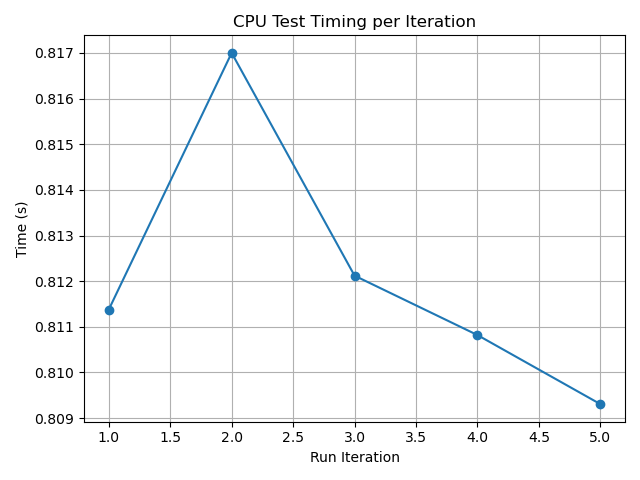
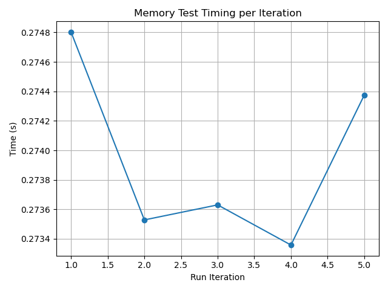
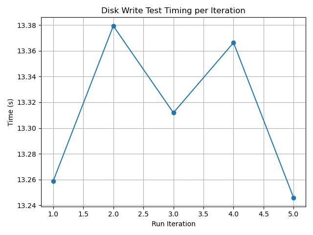
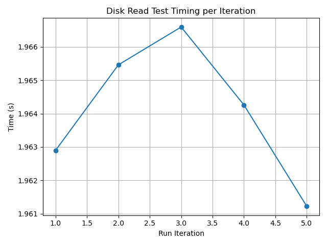
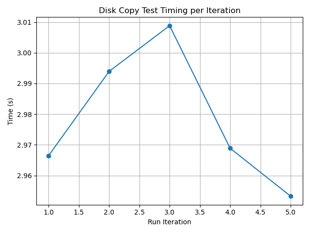
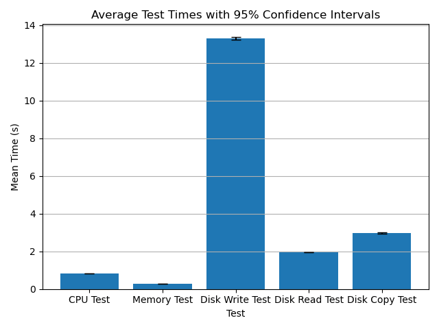

# Performance Test Results

## System Information
- **Timestamp:** 2025-04-13T15:12:40.762969
- **Os:** Linux-6.12.21-1-lts-x86_64-with
- **Python version:** 3.12.10
- **Cpu count:** 12
- **Total memory:** 16694824960
- **Available memory:** 13528965120

## Test Results
### CPU Test
- **Mean Time:** 0.8121 seconds
- **Median Time:** 0.8114 seconds
- **Standard Deviation:** 0.0029 seconds
- **25th Percentile:** 0.8101 seconds
- **75th Percentile:** 0.8146 seconds
- **Min Time:** 0.8093 seconds
- **Max Time:** 0.8170 seconds
- **95% Confidence Interval:** (0.8085, 0.8157) seconds

### Memory Test
- **Mean Time:** 0.2739 seconds
- **Median Time:** 0.2736 seconds
- **Standard Deviation:** 0.0006 seconds
- **25th Percentile:** 0.2734 seconds
- **75th Percentile:** 0.2746 seconds
- **Min Time:** 0.2734 seconds
- **Max Time:** 0.2748 seconds
- **95% Confidence Interval:** (0.2732, 0.2747) seconds

### Disk Write Test
- **Mean Time:** 13.3124 seconds
- **Median Time:** 13.3119 seconds
- **Standard Deviation:** 0.0607 seconds
- **25th Percentile:** 13.2523 seconds
- **75th Percentile:** 13.3729 seconds
- **Min Time:** 13.2457 seconds
- **Max Time:** 13.3794 seconds
- **95% Confidence Interval:** (13.2371, 13.3878) seconds

### Disk Read Test
- **Mean Time:** 1.9641 seconds
- **Median Time:** 1.9643 seconds
- **Standard Deviation:** 0.0021 seconds
- **25th Percentile:** 1.9621 seconds
- **75th Percentile:** 1.9660 seconds
- **Min Time:** 1.9612 seconds
- **Max Time:** 1.9666 seconds
- **95% Confidence Interval:** (1.9615, 1.9667) seconds

### Disk Copy Test
- **Mean Time:** 2.9783 seconds
- **Median Time:** 2.9689 seconds
- **Standard Deviation:** 0.0225 seconds
- **25th Percentile:** 2.9599 seconds
- **75th Percentile:** 3.0014 seconds
- **Min Time:** 2.9533 seconds
- **Max Time:** 3.0088 seconds
- **95% Confidence Interval:** (2.9503, 3.0063) seconds

## Comparison of Test Means

---
*Report generated on 2025-04-13T15:14:37.555776*