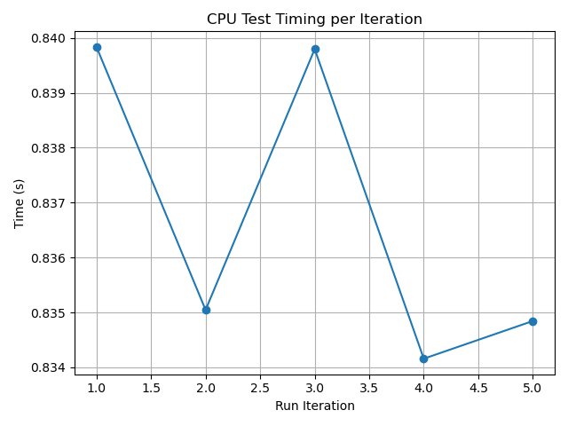
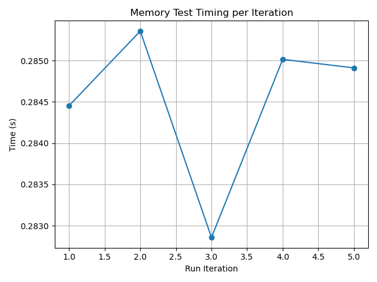
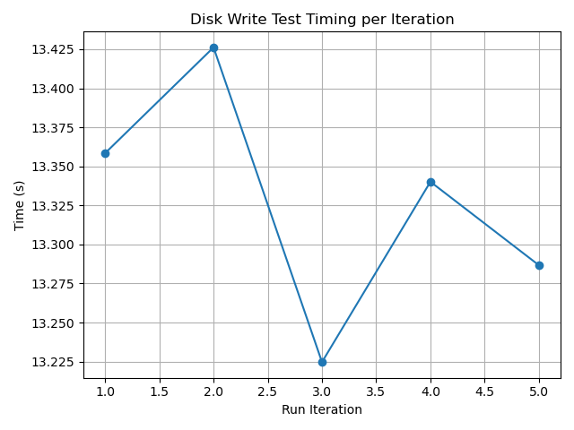
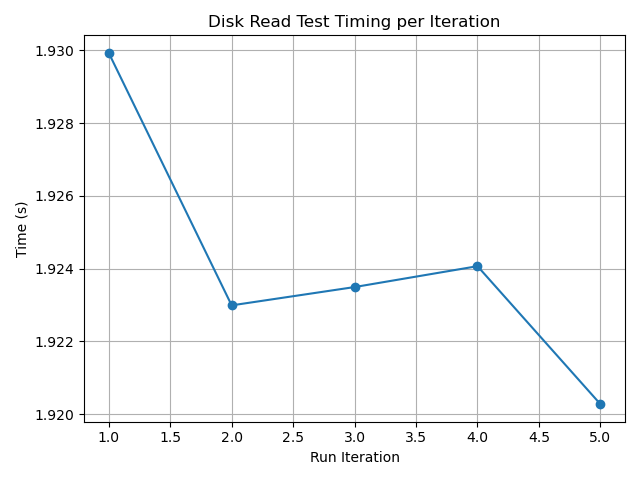
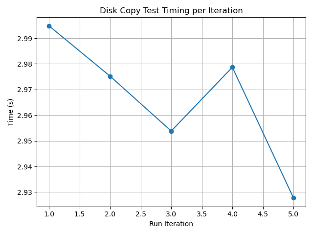
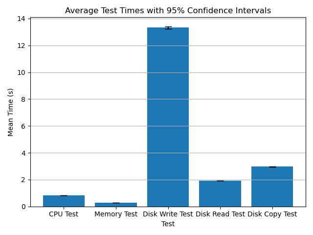

# Performance Test Results

## System Information
- **Timestamp:** 2025-04-13T15:27:53.417792
- **Os:** Linux-6.12.21-1-lts-x86_64-with
- **Python version:** 3.12.10
- **Cpu count:** 12
- **Total memory:** 16694824960
- **Available memory:** 13492645888

## Test Results
### CPU Test
- **Mean Time:** 0.8367 seconds
- **Median Time:** 0.8350 seconds
- **Standard Deviation:** 0.0028 seconds
- **25th Percentile:** 0.8345 seconds
- **75th Percentile:** 0.8398 seconds
- **Min Time:** 0.8342 seconds
- **Max Time:** 0.8398 seconds
- **95% Confidence Interval:** (0.8332, 0.8403) seconds

### Memory Test
- **Mean Time:** 0.2845 seconds
- **Median Time:** 0.2849 seconds
- **Standard Deviation:** 0.0010 seconds
- **25th Percentile:** 0.2837 seconds
- **75th Percentile:** 0.2852 seconds
- **Min Time:** 0.2829 seconds
- **Max Time:** 0.2854 seconds
- **95% Confidence Interval:** (0.2833, 0.2857) seconds

### Disk Write Test
- **Mean Time:** 13.3273 seconds
- **Median Time:** 13.3402 seconds
- **Standard Deviation:** 0.0760 seconds
- **25th Percentile:** 13.2557 seconds
- **75th Percentile:** 13.3923 seconds
- **Min Time:** 13.2247 seconds
- **Max Time:** 13.4262 seconds
- **95% Confidence Interval:** (13.2329, 13.4216) seconds

### Disk Read Test
- **Mean Time:** 1.9242 seconds
- **Median Time:** 1.9235 seconds
- **Standard Deviation:** 0.0035 seconds
- **25th Percentile:** 1.9216 seconds
- **75th Percentile:** 1.9270 seconds
- **Min Time:** 1.9203 seconds
- **Max Time:** 1.9299 seconds
- **95% Confidence Interval:** (1.9198, 1.9286) seconds

### Disk Copy Test
- **Mean Time:** 2.9661 seconds
- **Median Time:** 2.9752 seconds
- **Standard Deviation:** 0.0259 seconds
- **25th Percentile:** 2.9408 seconds
- **75th Percentile:** 2.9867 seconds
- **Min Time:** 2.9278 seconds
- **Max Time:** 2.9948 seconds
- **95% Confidence Interval:** (2.9339, 2.9982) seconds

## Comparison of Test Means

---
*Report generated on 2025-04-13T15:29:50.198239*