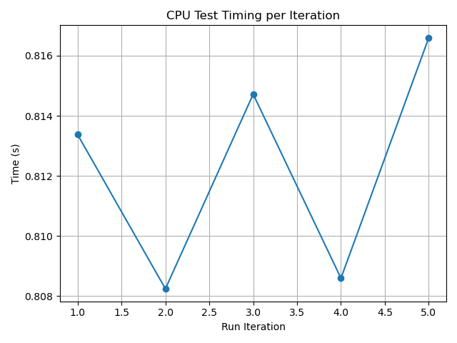
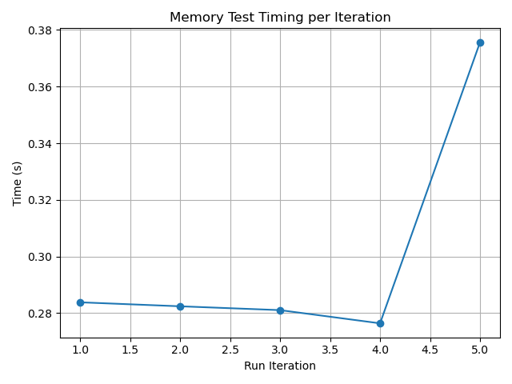
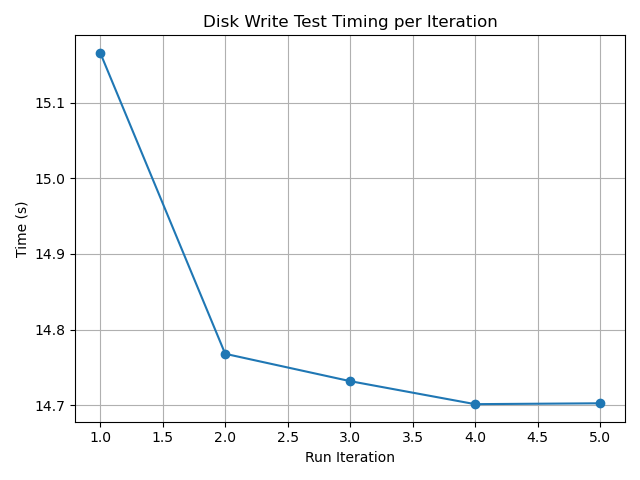
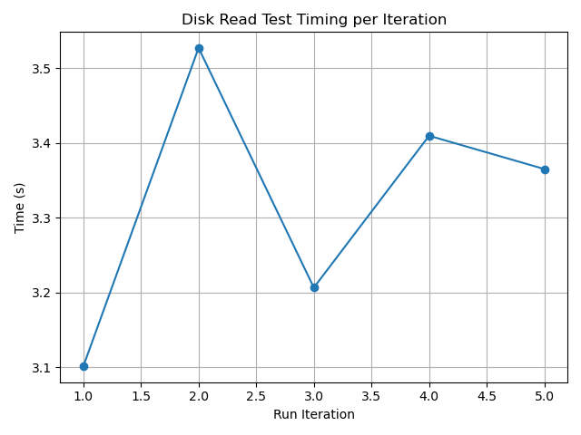
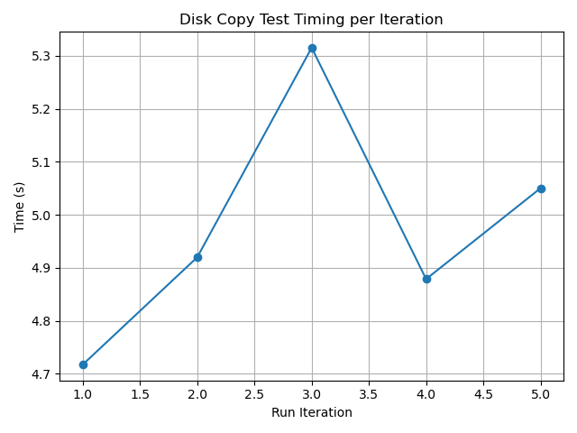
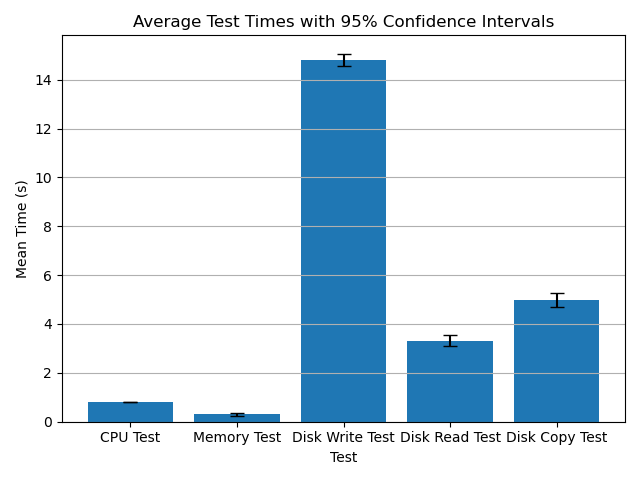

# Performance Test Results

## System Information
- **Timestamp:** 2025-04-13T15:38:30.535296
- **Os:** Linux-6.12.21-1-lts-x86_64-with
- **Python version:** 3.12.10
- **Cpu count:** 12
- **Total memory:** 16694824960
- **Available memory:** 2964029440

## Test Results
### CPU Test
- **Mean Time:** 0.8123 seconds
- **Median Time:** 0.8134 seconds
- **Standard Deviation:** 0.0037 seconds
- **25th Percentile:** 0.8084 seconds
- **75th Percentile:** 0.8157 seconds
- **Min Time:** 0.8082 seconds
- **Max Time:** 0.8166 seconds
- **95% Confidence Interval:** (0.8077, 0.8169) seconds

### Memory Test
- **Mean Time:** 0.2999 seconds
- **Median Time:** 0.2824 seconds
- **Standard Deviation:** 0.0424 seconds
- **25th Percentile:** 0.2787 seconds
- **75th Percentile:** 0.3297 seconds
- **Min Time:** 0.2764 seconds
- **Max Time:** 0.3756 seconds
- **95% Confidence Interval:** (0.2472, 0.3526) seconds

### Disk Write Test
- **Mean Time:** 14.8140 seconds
- **Median Time:** 14.7319 seconds
- **Standard Deviation:** 0.1985 seconds
- **25th Percentile:** 14.7021 seconds
- **75th Percentile:** 14.9669 seconds
- **Min Time:** 14.7015 seconds
- **Max Time:** 15.1657 seconds
- **95% Confidence Interval:** (14.5675, 15.0604) seconds

### Disk Read Test
- **Mean Time:** 3.3220 seconds
- **Median Time:** 3.3651 seconds
- **Standard Deviation:** 0.1685 seconds
- **25th Percentile:** 3.1540 seconds
- **75th Percentile:** 3.4683 seconds
- **Min Time:** 3.1015 seconds
- **Max Time:** 3.5270 seconds
- **95% Confidence Interval:** (3.1128, 3.5311) seconds

### Disk Copy Test
- **Mean Time:** 4.9764 seconds
- **Median Time:** 4.9199 seconds
- **Standard Deviation:** 0.2237 seconds
- **25th Percentile:** 4.7981 seconds
- **75th Percentile:** 5.1829 seconds
- **Min Time:** 4.7175 seconds
- **Max Time:** 5.3153 seconds
- **95% Confidence Interval:** (4.6987, 5.2541) seconds

## Comparison of Test Means

---
*Report generated on 2025-04-13T15:40:56.856151*