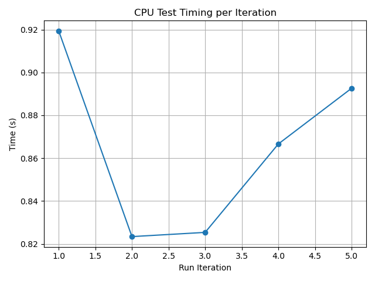
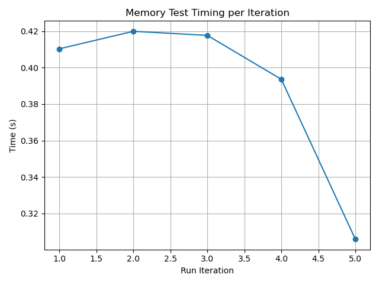
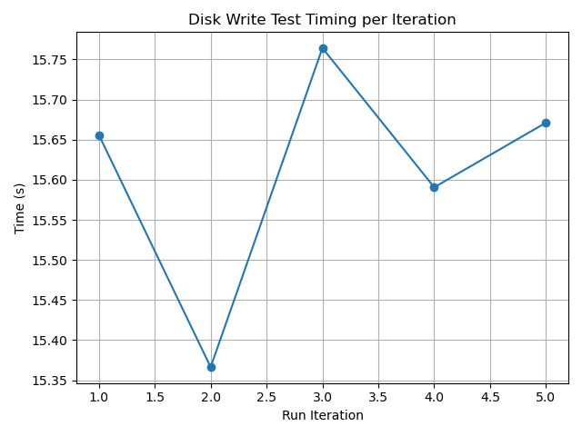
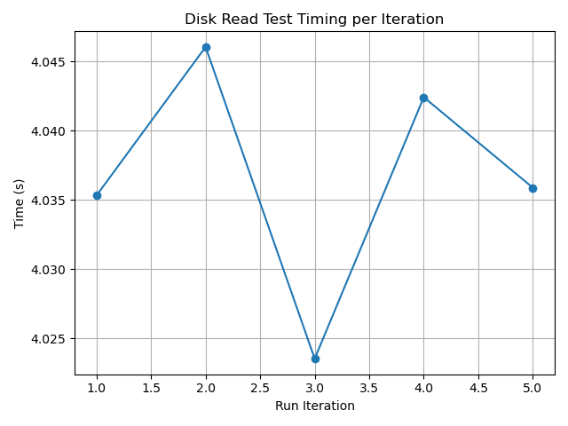
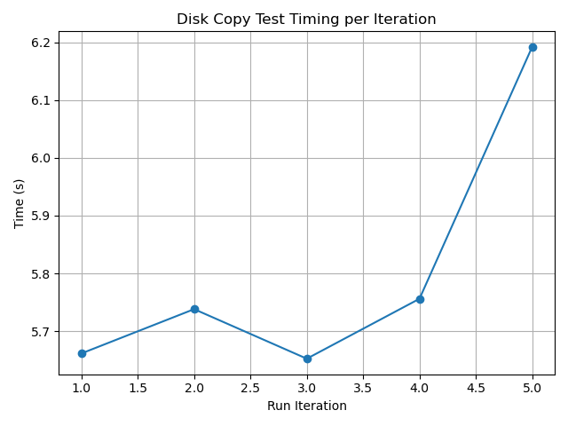
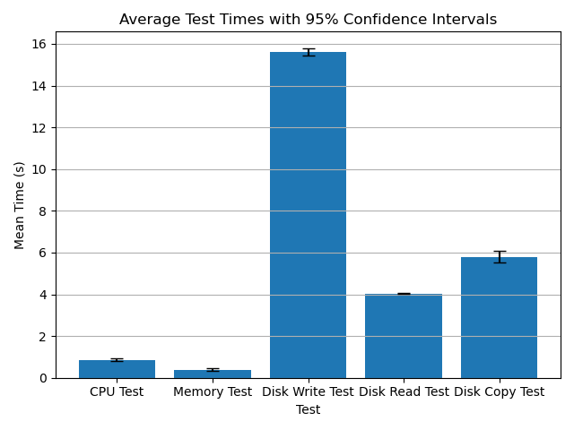

# Performance Test Results

## System Information
- **Timestamp:** 2025-04-13T15:44:11.396481
- **Os:** Linux-6.12.21-1-lts-x86_64-with
- **Python version:** 3.12.10
- **Cpu count:** 12
- **Total memory:** 16694824960
- **Available memory:** 11124002816

## Test Results
### CPU Test
- **Mean Time:** 0.8655 seconds
- **Median Time:** 0.8666 seconds
- **Standard Deviation:** 0.0419 seconds
- **25th Percentile:** 0.8244 seconds
- **75th Percentile:** 0.9060 seconds
- **Min Time:** 0.8234 seconds
- **Max Time:** 0.9194 seconds
- **95% Confidence Interval:** (0.8135, 0.9175) seconds

### Memory Test
- **Mean Time:** 0.3895 seconds
- **Median Time:** 0.4103 seconds
- **Standard Deviation:** 0.0478 seconds
- **25th Percentile:** 0.3498 seconds
- **75th Percentile:** 0.4188 seconds
- **Min Time:** 0.3060 seconds
- **Max Time:** 0.4199 seconds
- **95% Confidence Interval:** (0.3301, 0.4489) seconds

### Disk Write Test
- **Mean Time:** 15.6096 seconds
- **Median Time:** 15.6558 seconds
- **Standard Deviation:** 0.1495 seconds
- **25th Percentile:** 15.4784 seconds
- **75th Percentile:** 15.7177 seconds
- **Min Time:** 15.3663 seconds
- **Max Time:** 15.7642 seconds
- **95% Confidence Interval:** (15.4240, 15.7952) seconds

### Disk Read Test
- **Mean Time:** 4.0366 seconds
- **Median Time:** 4.0359 seconds
- **Standard Deviation:** 0.0086 seconds
- **25th Percentile:** 4.0294 seconds
- **75th Percentile:** 4.0442 seconds
- **Min Time:** 4.0235 seconds
- **Max Time:** 4.0461 seconds
- **95% Confidence Interval:** (4.0260, 4.0473) seconds

### Disk Copy Test
- **Mean Time:** 5.8000 seconds
- **Median Time:** 5.7380 seconds
- **Standard Deviation:** 0.2239 seconds
- **25th Percentile:** 5.6568 seconds
- **75th Percentile:** 5.9741 seconds
- **Min Time:** 5.6522 seconds
- **Max Time:** 6.1921 seconds
- **95% Confidence Interval:** (5.5219, 6.0780) seconds

## Comparison of Test Means

---
*Report generated on 2025-04-13T15:46:52.131929*