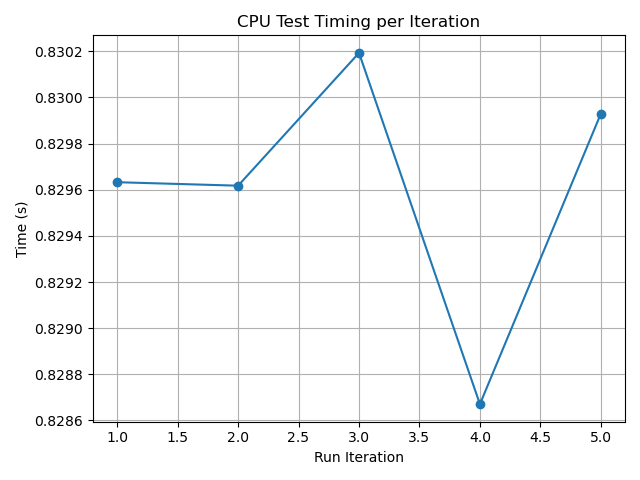
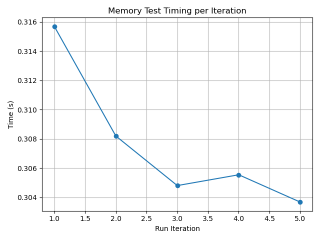
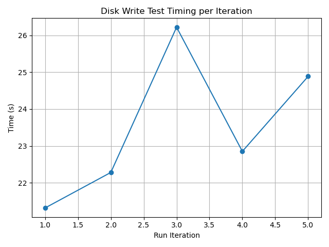
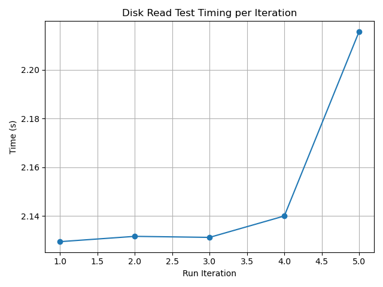
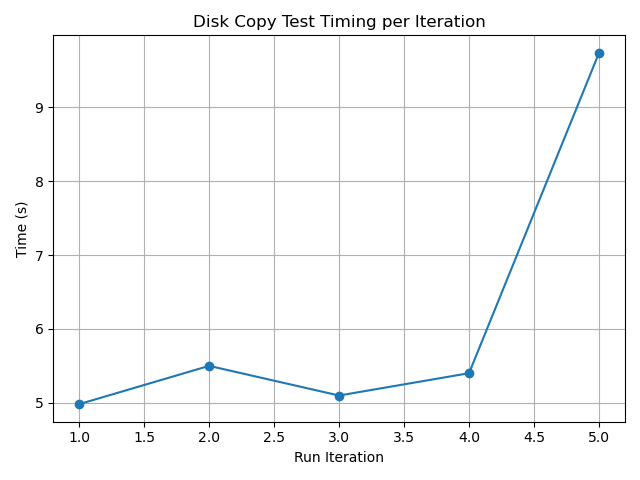
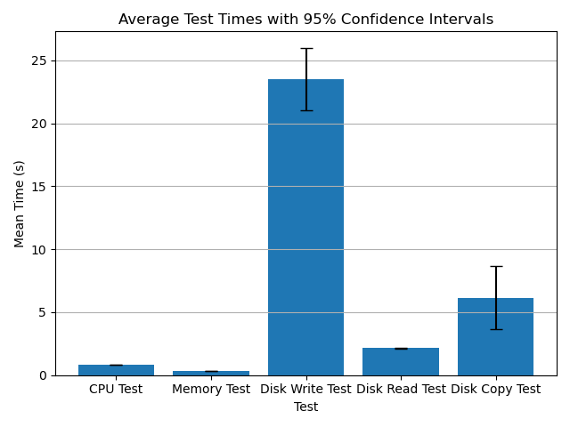

# Performance Test Results

## System Information
- **Timestamp:** 2025-04-20T21:04:54.621838
- **Os:** Linux-6.12.21-1-lts-x86_64-with
- **Python version:** 3.12.10
- **Cpu count:** 12
- **Total memory:** 16694820864
- **Available memory:** 703856640

## Test Results
### CPU Test
- **Mean Time:** 0.8296 seconds
- **Median Time:** 0.8296 seconds
- **Standard Deviation:** 0.0006 seconds
- **25th Percentile:** 0.8291 seconds
- **75th Percentile:** 0.8301 seconds
- **Min Time:** 0.8287 seconds
- **Max Time:** 0.8302 seconds
- **95% Confidence Interval:** (0.8289, 0.8303) seconds

### Memory Test
- **Mean Time:** 0.3076 seconds
- **Median Time:** 0.3056 seconds
- **Standard Deviation:** 0.0048 seconds
- **25th Percentile:** 0.3043 seconds
- **75th Percentile:** 0.3119 seconds
- **Min Time:** 0.3037 seconds
- **Max Time:** 0.3157 seconds
- **95% Confidence Interval:** (0.3016, 0.3136) seconds

### Disk Write Test
- **Mean Time:** 23.5110 seconds
- **Median Time:** 22.8514 seconds
- **Standard Deviation:** 2.0018 seconds
- **25th Percentile:** 21.7966 seconds
- **75th Percentile:** 25.5553 seconds
- **Min Time:** 21.3143 seconds
- **Max Time:** 26.2230 seconds
- **95% Confidence Interval:** (21.0255, 25.9966) seconds

### Disk Read Test
- **Mean Time:** 2.1496 seconds
- **Median Time:** 2.1316 seconds
- **Standard Deviation:** 0.0372 seconds
- **25th Percentile:** 2.1303 seconds
- **75th Percentile:** 2.1778 seconds
- **Min Time:** 2.1294 seconds
- **Max Time:** 2.2157 seconds
- **95% Confidence Interval:** (2.1034, 2.1957) seconds

### Disk Copy Test
- **Mean Time:** 6.1444 seconds
- **Median Time:** 5.4014 seconds
- **Standard Deviation:** 2.0206 seconds
- **25th Percentile:** 5.0404 seconds
- **75th Percentile:** 7.6198 seconds
- **Min Time:** 4.9820 seconds
- **Max Time:** 9.7389 seconds
- **95% Confidence Interval:** (3.6355, 8.6533) seconds

## Comparison of Test Means

---
*Report generated on 2025-04-20T21:08:24.722373*