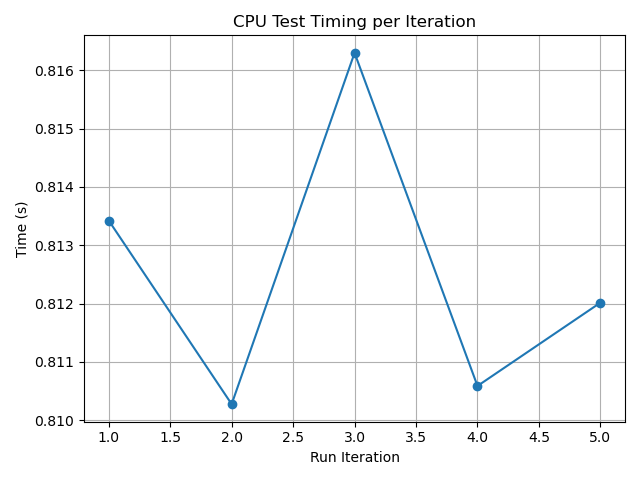
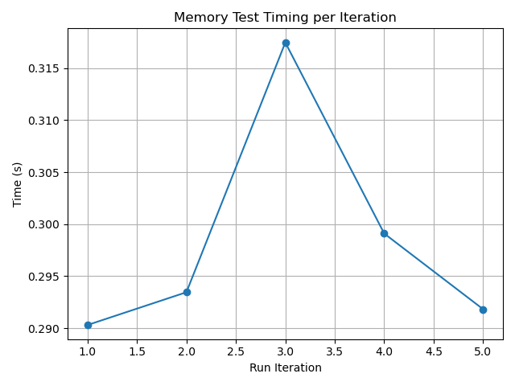
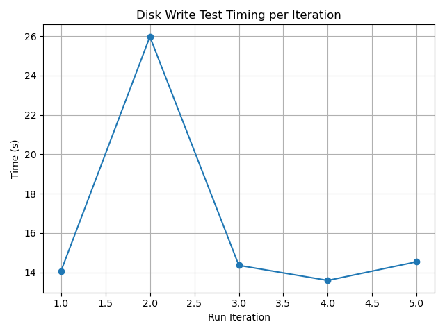
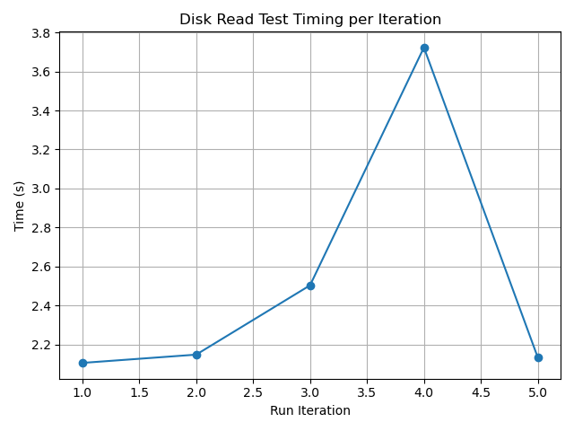
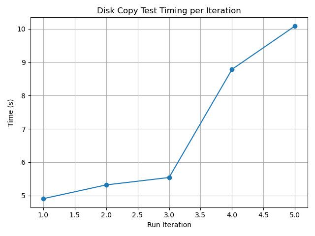
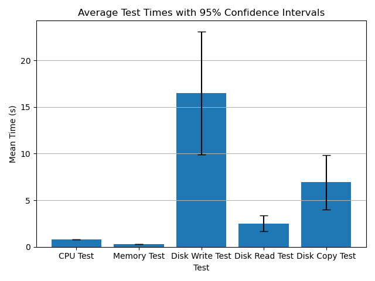

# Performance Test Results

## System Information
- **Timestamp:** 2025-04-20T21:12:18.463332
- **Os:** Linux-6.12.21-1-lts-x86_64-with
- **Python version:** 3.12.10
- **Cpu count:** 12
- **Total memory:** 16694820864
- **Available memory:** 152068096

## Test Results
### CPU Test
- **Mean Time:** 0.8125 seconds
- **Median Time:** 0.8120 seconds
- **Standard Deviation:** 0.0025 seconds
- **25th Percentile:** 0.8104 seconds
- **75th Percentile:** 0.8149 seconds
- **Min Time:** 0.8103 seconds
- **Max Time:** 0.8163 seconds
- **95% Confidence Interval:** (0.8095, 0.8156) seconds

### Memory Test
- **Mean Time:** 0.2984 seconds
- **Median Time:** 0.2935 seconds
- **Standard Deviation:** 0.0111 seconds
- **25th Percentile:** 0.2911 seconds
- **75th Percentile:** 0.3083 seconds
- **Min Time:** 0.2903 seconds
- **Max Time:** 0.3175 seconds
- **95% Confidence Interval:** (0.2846, 0.3123) seconds

### Disk Write Test
- **Mean Time:** 16.5013 seconds
- **Median Time:** 14.3530 seconds
- **Standard Deviation:** 5.3085 seconds
- **25th Percentile:** 13.8214 seconds
- **75th Percentile:** 20.2555 seconds
- **Min Time:** 13.5891 seconds
- **Max Time:** 25.9758 seconds
- **95% Confidence Interval:** (9.9100, 23.0927) seconds

### Disk Read Test
- **Mean Time:** 2.5228 seconds
- **Median Time:** 2.1480 seconds
- **Standard Deviation:** 0.6904 seconds
- **25th Percentile:** 2.1197 seconds
- **75th Percentile:** 3.1132 seconds
- **Min Time:** 2.1056 seconds
- **Max Time:** 3.7230 seconds
- **95% Confidence Interval:** (1.6655, 3.3800) seconds

### Disk Copy Test
- **Mean Time:** 6.9274 seconds
- **Median Time:** 5.5408 seconds
- **Standard Deviation:** 2.3478 seconds
- **25th Percentile:** 5.1109 seconds
- **75th Percentile:** 9.4370 seconds
- **Min Time:** 4.9041 seconds
- **Max Time:** 10.0868 seconds
- **95% Confidence Interval:** (4.0122, 9.8425) seconds

## Comparison of Test Means

---
*Report generated on 2025-04-20T21:15:00.823651*